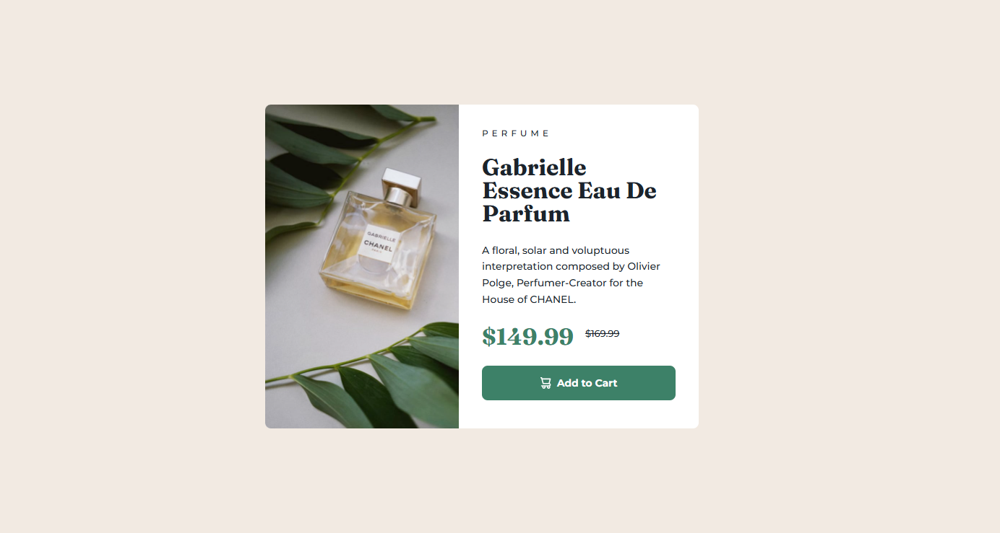

# Frontend Mentor - Product preview card component solution

This is a solution to the [Product preview card component challenge on Frontend Mentor](https://www.frontendmentor.io/challenges/product-preview-card-component-GO7UmttRfa).

## Table of contents

- [Overview](#overview)
  - [Screenshot](#screenshot)
  - [Links](#links)
- [My process](#my-process)
  - [Built with](#built-with)
  - [What I learned](#what-i-learned)
  - [Useful resources](#useful-resources)
- [Author](#author)

## Overview

### Screenshot




### Links

- Solution URL: [Click Me](https://github.com/shakthivel-rn/product-preview-card-component)
- Live Site URL: [Click Me](https://shakthivel-rn.github.io/product-preview-card-component/)

## My process

### Built with

- HTMl
- CSS
- Flexbox

**Note: These are just examples. Delete this note and replace the list above with your own choices**

### What I learned

- I learned about making the website responsive for mobile and desktop using relative units. Using relative units is considered best practice.

```css
@media (min-width: 90rem) {
  .card-container {
    width: 37.5rem;
    height: 28.12rem;
    display: flex;
  }

  .card-image {
    flex: 1;
    height: 100%;
    border-bottom-left-radius: 0.5rem;
    border-top-right-radius: 0;
    background-image: url(./images/image-product-desktop.jpg);
  }

  .card-content {
    flex: 1;
    padding: 2rem;
    row-gap: 1.5rem;
  }
}
```

### Useful resources

- [Web Dev](https://web.dev/learn/design) - This helped me learn more about responsive design

## Author

- Website - [Shakthivel Ramesh Nirmala](https://shakthivel-portfolio.vercel.app/)
- Frontend Mentor - [@shakthivel-rn](https://www.frontendmentor.io/profile/shakthivel-rn)
